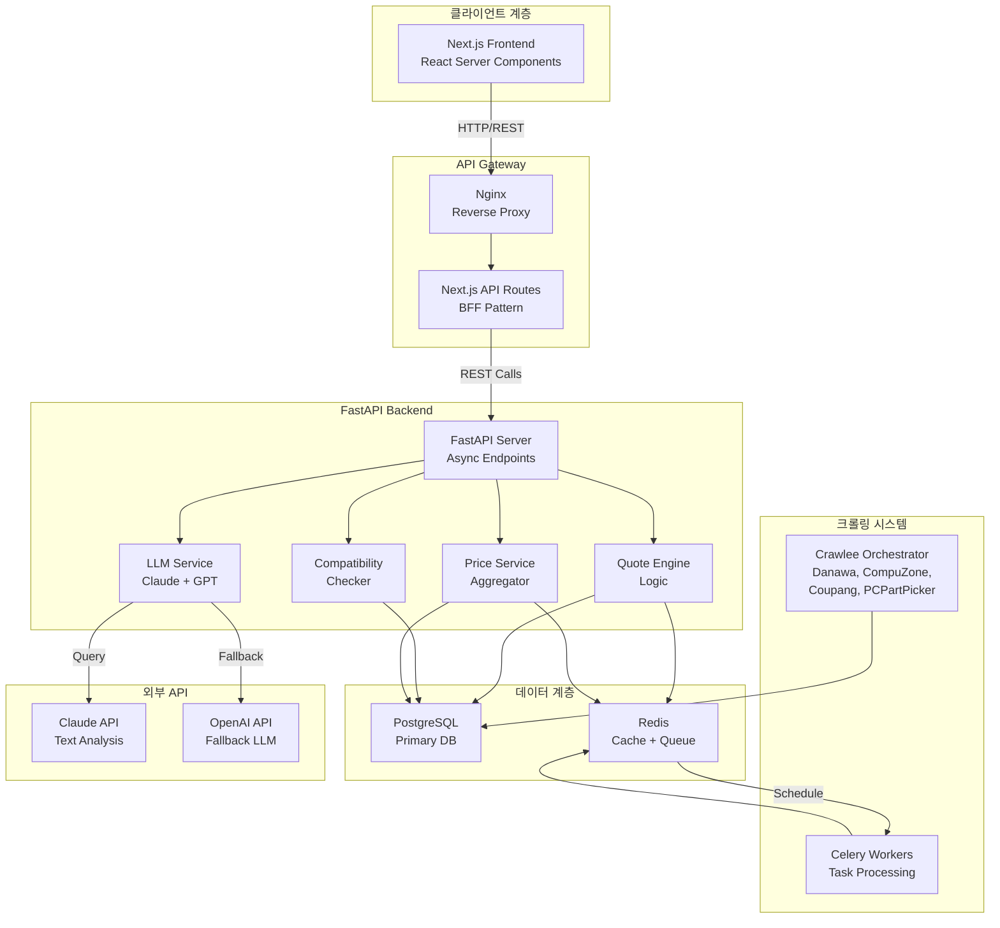

# PC Build Advisor - 개요 및 아키텍처

> 📁 **전체 문서 목차**: [INDEX.md](./INDEX.md)

## 1. 프로젝트 개요

### 1.1 프로젝트 정의
- **프로젝트명**: PC Build Advisor (PC 견적 자동 추천 시스템)
- **목표**: 사용자가 자연어로 요구사항을 입력하면 AI가 분석하여 최소/중간/최대 3가지 PC 견적을 자동 생성
- **대상 사용자**: 모든 사용자 (일반인~전문가)
- **핵심 가치 제안**:
  - 복잡한 PC 부품 호환성을 자동 검증
  - 자연어 기반의 직관적인 요구사항 분석
  - 실시간 가격 정보 기반의 신뢰할 수 있는 견적
  - 다양한 예산대와 성능 수준에 맞춘 선택지 제공

### 1.2 주요 기능
1. **자연어 기반 요구사항 분석**: "배그를 렉 없이 돌리고 싶어" → 자동 분석
2. **3단계 견적 생성**: 최소(Minimum), 중간(Balanced), 최대(Maximum)
3. **호환성 자동 검증**: CPU-MB 소켓, RAM-MB DDR 세대, GPU-PSU 전력 등
4. **실시간 가격 비교**: 다나와, 컴퓨존, 쿠팡, PCPartPicker
5. **부품 상세 정보**: 성능 벤치마크, 전력 소비, 물리적 크기 등
6. **커스터마이징**: 생성된 견적의 부품을 교체하며 호환성 재검사

---

## 2. 기술 스택

### 2.1 Frontend
- **Framework**: Next.js 14+ (App Router, React Server Components)
- **Language**: TypeScript
- **Styling**: Tailwind CSS + shadcn/ui
- **State Management**: React Query + Zustand
- **Form Handling**: React Hook Form
- **Charts**: Recharts (가격 비교 차트)
- **API Communication**: Axios + Interceptors

### 2.2 Backend
- **Framework**: FastAPI (Python 3.10+)
- **async**: asyncio + aiohttp
- **ORM**: SQLAlchemy 2.0 (async support)
- **Validation**: Pydantic v2
- **HTTP Client**: httpx (async)

### 2.3 Data & Cache
- **Primary Database**: PostgreSQL 14+
- **Cache Layer**: Redis 6+
- **Cache TTL Strategy**:
  - 부품 정보: 24시간
  - 가격 정보: 6시간
  - 세션 데이터: 1시간

### 2.4 Crawling & Data Extraction
- **Orchestration**: Crawlee (Python)
- **HTML Parsing**: BeautifulSoup 4
- **Browser Automation**: Playwright (동적 렌더링)
- **Rate Limiting**: 사이트당 2-5초 간격

### 2.5 Task Queue & Scheduling
- **Message Broker**: Redis
- **Task Queue**: Celery 5+
- **Scheduler**: Celery Beat
- **Monitoring**: Flower (optional)

### 2.6 LLM Integration
- **Primary**: Claude API (Anthropic)
  - Model: claude-3-5-sonnet-20241022
  - Context Window: 200K tokens
- **Fallback**: OpenAI GPT-4 / GPT-4o
- **Caching**: Redis (프롬프트 결과 캐싱)

### 2.7 Deployment & Infrastructure
- **Containerization**: Docker + Docker Compose
- **Container Registry**: Docker Hub / GitHub Container Registry
- **Orchestration**: Kubernetes (선택사항)
- **API Gateway**: Nginx (reverse proxy)
- **Logging**: ELK Stack / CloudWatch
- **Monitoring**: Prometheus + Grafana

---

## 3. 시스템 아키텍처 다이어그램



### 3.1 데이터 흐름 상세

```
User Input (자연어)
    ↓
[Frontend] Next.js 채팅 UI
    ↓
[BFF] Next.js API Routes (토큰 검증, 요청 변환)
    ↓
[Backend] POST /api/v1/quotes/generate
    ↓
[LLM Service] 자연어 분석 (Claude API)
    ↓ (추출된 요구사항)
[Quote Engine] 3가지 견적 생성
    ├─ Minimum: 최소 요구사항 충족
    ├─ Balanced: 가성비 최적화
    └─ Maximum: 최고 성능
    ↓
[Compatibility Checker] 각 견적의 호환성 검증
    ↓
[Price Service] 실시간 가격 조회 (Redis 캐시 + DB)
    ↓
[Response] JSON 응답
    ↓
[Frontend] 3단계 탭으로 시각화
```

---
